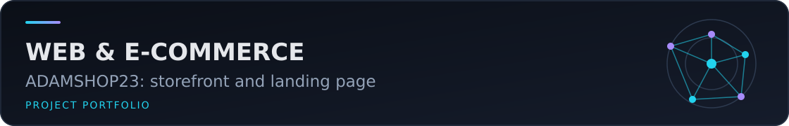

# Online Shop with Landing Page – PrestaShop, WordPress

Academic e-commerce demonstration named **ADAMSHOP23**, combining a PrestaShop storefront and administration interface with a WordPress landing page.

## Verified material

The available demonstration shows product browsing and storefront pages, PrestaShop administration and a WordPress landing page. The original workspace is a complete XAMPP installation containing third-party platform code, caches and sensitive configuration surfaces. It does not isolate an attributable custom theme or plugin, and no separate project report or presentation was found.

## Public repository contents

- [Video demonstration (GitHub Release)](https://github.com/adamelakkaoui/online-shop-with-landing-page-prestashop-wordpress/releases/tag/academic-demo) — 13-minute French demonstration, remuxed without source metadata.

The XAMPP tree, databases, credentials, caches, downloaded PrestaShop/WordPress dependencies and administration configuration are deliberately excluded. This documentation repository does not redistribute either platform and does not claim authorship of their code.

## Reproduction notes

No reproducible deployment package can be constructed safely from the submitted bundle. A future reconstruction would require clean PrestaShop and WordPress installations matching the historical environment, an attributable export of the custom configuration/content, and placeholder-only connection settings. No `.env` file or database dump is published.

## Testing and limitations

The video was visually reviewed and its streams were checked. The storefront was not relaunched because the original application state depends on the excluded XAMPP databases and configuration. Features are therefore described only from the recorded demonstration. The absence of isolated authored source means this repository is documentary rather than a deployable application.

## Author and credits

Adam El Akkaoui is identified by the submitted project and video filenames. PrestaShop, WordPress, XAMPP and their bundled components remain third-party software under their respective terms. No teammate name was established in the inspected project evidence.
